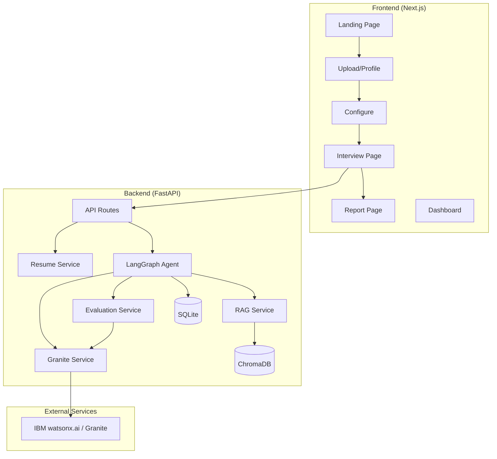
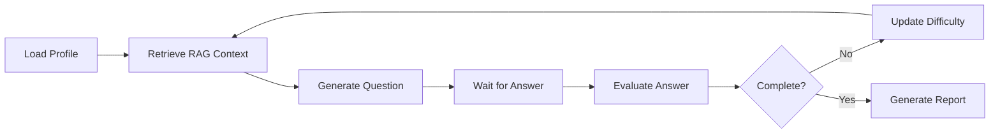

# InterviewAI – Agentic Interview Trainer
> An AI-powered, personalized interview trainer that uses IBM Granite, RAG, and LangGraph to deliver adaptive interview experiences.
---

## 📋 Project Overview

InterviewAI is a full-stack web application that prepares users for job interviews by generating tailored question sets and providing real-time evaluation through an agentic AI pipeline. The system uses:

- **IBM Granite** as the primary LLM for question generation, answer evaluation, and profile extraction
- **RAG (Retrieval-Augmented Generation)** with ChromaDB for role-specific knowledge retrieval
- **LangGraph** for agentic adaptive interview orchestration
- **Resume Parsing** via PyMuPDF for automatic candidate profiling

### Core Flow

```
User → Upload Resume / Enter Profile → AI Profile Extraction → Interview Configuration
→ RAG Context Retrieval → IBM Granite Question Generation → Candidate Answer
→ AI Evaluation → Adaptive Next Question → ... → Final Report + Skill Gap Analysis
```

---

## 🏗️ Architecture



---

## 🛠️ Tech Stack

| Layer | Technology |
|-------|-----------|
| Frontend | Next.js 14, React 18, TypeScript, Tailwind CSS |
| Backend | Python, FastAPI |
| AI/LLM | IBM Granite (via IBM watsonx.ai) |
| Agent | LangGraph (StateGraph) |
| RAG | LangChain, ChromaDB, sentence-transformers |
| Resume Parser | PyMuPDF (fitz) |
| Database | SQLite + SQLAlchemy ORM |
| Charts | Recharts |

---

## 🤖 IBM Granite Integration

IBM Granite is the **primary LLM** powering all AI features:

1. **Profile Extraction** – Parses resume text into structured candidate profiles
2. **Question Generation** – Creates role-specific, difficulty-appropriate interview questions
3. **Answer Evaluation** – Provides structured scoring (0-10) across multiple dimensions
4. **Report Generation** – Produces comprehensive interview performance reports

### Configuration

The system supports two modes:

| Mode | `AI_PROVIDER` | Description |
|------|--------------|-------------|
| IBM Granite | `ibm_granite` | Production mode using IBM watsonx.ai |
| Mock | `mock` | Development mode with realistic mock responses |

To enable IBM Granite:

```bash
AI_PROVIDER=ibm_granite
IBM_API_KEY=your_key_here
IBM_PROJECT_ID=your_project_id
IBM_URL=https://us-south.ml.cloud.ibm.com
IBM_GRANITE_MODEL=ibm/granite-3-8b-instruct
```

---

## 📚 RAG Architecture

The knowledge base consists of 15+ curated markdown documents covering:

- Python, Machine Learning, Data Science
- Software Engineering, OOP, DSA, SQL
- Deep Learning, NLP, Generative AI, RAG
- System Design, DevOps
- HR, Behavioral (STAR method)

### RAG Pipeline

```
Documents (.md) → Text Splitter (1000 chars, 200 overlap)
→ sentence-transformers (all-MiniLM-L6-v2) → ChromaDB Vector Store
→ Similarity Search → Context → IBM Granite → Response
```

---

## 🔄 LangGraph Workflow

The interview agent implements an adaptive workflow:



### Adaptive Difficulty Logic

- Score ≥ 8/10 → **Increase** difficulty (easy → medium → hard)
- Score ≤ 4/10 → **Decrease** difficulty (hard → medium → easy)
- Score 5-7/10 → **Maintain** current difficulty

The agent tracks skills tested to avoid repetition and considers previous Q&A context.

---

## 🚀 Setup Instructions

### Prerequisites

- Python 3.10+
- Node.js 18+
- npm or yarn

### Quick Start (One-Click for Windows)

Simply double-click `run_app.bat` or run:
```cmd
run_app.bat
```
This automatically initializes the environment, launches the FastAPI backend and Next.js frontend, and opens the application at `http://localhost:3000`.

Sample PDF resumes are included in `sample_resumes/` for immediate upload testing:
- `sample_resumes/alex_sharma_ml_engineer.pdf`
- `sample_resumes/priya_patel_fullstack_dev.pdf`

---

### Manual Setup

### 1. Clone & Configure

```bash
cd interview-ai
cp .env.example .env
# Edit .env with your settings
```

### 2. Backend Setup

```bash
cd backend
python -m venv venv

# Windows
venv\Scripts\activate
# macOS/Linux
source venv/bin/activate

pip install -r requirements.txt
```

### 3. Ingest Knowledge Base

```bash
cd backend
python scripts/ingest_documents.py
```

### 4. Start Backend

```bash
cd backend
uvicorn main:app --reload --port 8000
```

### 5. Frontend Setup

```bash
cd frontend
npm install
npm run dev
```

### 6. Open Application

Visit `http://localhost:3000`

---

## 📝 Environment Variables

| Variable | Required | Description |
|----------|----------|-------------|
| `AI_PROVIDER` | Yes | `ibm_granite` or `mock` |
| `IBM_API_KEY` | For IBM mode | IBM Cloud API key |
| `IBM_PROJECT_ID` | For IBM mode | watsonx.ai project ID |
| `IBM_URL` | For IBM mode | IBM watsonx.ai endpoint |
| `IBM_GRANITE_MODEL` | For IBM mode | Model ID (e.g., `ibm/granite-3-8b-instruct`) |
| `DATABASE_URL` | No | SQLite URL (default: `sqlite:///./interview_ai.db`) |
| `CHROMA_PERSIST_DIR` | No | ChromaDB storage path |

---

## 📡 API Documentation

| Endpoint | Method | Description |
|----------|--------|-------------|
| `/api/health` | GET | Health check with AI provider info |
| `/api/resume/upload` | POST | Upload PDF resume |
| `/api/profile/extract` | POST | Extract profile from text |
| `/api/profile/manual` | POST | Create manual profile |
| `/api/interview/create` | POST | Start new interview |
| `/api/interview/answer` | POST | Submit answer for evaluation |
| `/api/interview/next` | POST | Get next question |
| `/api/interview/finish` | POST | Complete interview, get report |
| `/api/interview/{id}` | GET | Get interview status |
| `/api/report/{id}` | GET | Get interview report |
| `/api/dashboard/stats` | GET | Dashboard statistics |

---

## 🎯 Demo Mode

Click **"Try Demo"** on the landing page to start with a pre-configured profile:

- **Name:** Alex Sharma
- **Role:** ML Engineer
- **Skills:** Python, Machine Learning, Deep Learning, RAG, NLP
- **Experience:** Fresher

This allows instant demonstration without resume upload or manual entry.

---

## 🏗️ Project Structure

```
interview-ai/
├── frontend/
│   ├── app/                    # Next.js pages
│   │   ├── page.tsx           # Landing page
│   │   ├── upload/            # Resume upload
│   │   ├── configure/         # Interview config
│   │   ├── interview/[id]/    # Interview UI
│   │   ├── report/[id]/       # Report page
│   │   └── dashboard/         # Dashboard
│   ├── components/            # Reusable UI components
│   ├── lib/api.ts             # API client
│   └── types/index.ts         # TypeScript types
│
├── backend/
│   ├── main.py                # FastAPI entry point
│   ├── config.py              # Settings
│   ├── api/                   # API route handlers
│   ├── agents/                # LangGraph agent
│   ├── services/              # Business logic
│   │   ├── granite_service.py # IBM Granite integration
│   │   ├── rag_service.py     # RAG pipeline
│   │   ├── resume_service.py  # Resume parsing
│   │   └── evaluation_service.py
│   ├── models/                # SQLAlchemy models
│   ├── schemas/               # Pydantic schemas
│   ├── database/              # DB setup
│   ├── data/                  # Knowledge base documents
│   └── scripts/               # Utility scripts
│
├── .env.example
├── docker-compose.yml
└── README.md
```

---

## 🔮 Future Improvements

- [ ] Voice-based interview mode
- [ ] Advanced analytics and trend visualization
- [ ] Multi-language support
- [ ] Company-specific question databases
- [ ] Interview recording and playback
- [ ] Peer comparison metrics
- [ ] Integration with job portals
- [ ] Mobile-responsive PWA
- [ ] Collaborative interview practice
- [ ] Custom knowledge base uploads

---

## 🏆 Competition Demo Flow (3-5 minutes)

1. **Open landing page** → Show modern UI, "Powered by IBM Granite"
2. **Click "Try Demo"** → Pre-filled ML Engineer profile
3. **Configure interview** → Select Adaptive difficulty, 5 questions
4. **Answer Question 1** with a strong, detailed answer → Show high score evaluation
5. **Answer Question 2** with a weak answer → Show lower score, constructive feedback
6. **Observe adaptive difficulty** → Agent adjusts to easier question
7. **Complete interview** → View comprehensive final report
8. **Highlight** → IBM Granite + RAG + LangGraph + Adaptive behavior

---

## 📜 License

Built for AICTE 2026 Innovation Challenge. Educational use.
