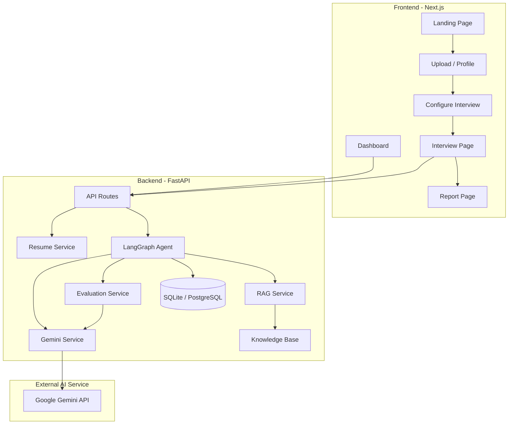
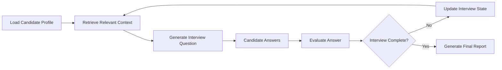

# InterviewAI – Agentic Interview Trainer

> An AI-powered, personalized interview trainer that uses **Google Gemini, RAG, and LangGraph** to deliver adaptive interview experiences.

---

## 📋 Project Overview

InterviewAI is a full-stack web application that helps candidates prepare for technical and behavioral interviews.

The application:

- Extracts candidate information from uploaded resumes
- Builds a personalized candidate profile
- Generates role- and skill-specific interview questions
- Uses **Google Gemini** for AI-powered profile extraction, question generation, and answer evaluation
- Uses a **RAG (Retrieval-Augmented Generation)** pipeline to provide role-specific knowledge and context
- Uses **LangGraph** to orchestrate the adaptive interview workflow
- Adjusts interview difficulty based on the candidate's performance
- Generates a final interview report with scores, feedback, and skill-gap insights
- Provides a dashboard for viewing interview statistics

### Core Flow

```text
User
  ↓
Upload Resume / Enter Profile
  ↓
Profile Extraction
  ↓
Interview Configuration
  ↓
RAG Context Retrieval
  ↓
Gemini Question Generation
  ↓
Candidate Answer
  ↓
Gemini Answer Evaluation
  ↓
Adaptive Next Question
  ↓
Final Report + Skill Gap Analysis
```

---

## 🏗️ Architecture



### Architecture Highlights

- **Frontend:** Next.js application with TypeScript and Tailwind CSS
- **Backend:** FastAPI REST API
- **AI:** Google Gemini through the `google-genai` SDK
- **Agent orchestration:** LangGraph
- **RAG:** Knowledge-base retrieval from the project's curated interview material
- **Resume processing:** PyMuPDF
- **Database:** SQLite locally, PostgreSQL supported for production
- **Deployment:** Vercel

---

## 🛠️ Tech Stack

| Layer | Technology |
|---|---|
| Frontend | Next.js 14, React 18, TypeScript, Tailwind CSS |
| Backend | Python, FastAPI |
| AI / LLM | Google Gemini (`gemini-2.5-flash`) |
| AI SDK | Google Gen AI SDK (`google-genai`) |
| Agent | LangGraph (`StateGraph`) |
| RAG | LangChain text splitters + project knowledge base |
| Resume Parser | PyMuPDF (`fitz`) |
| Database | SQLite + SQLAlchemy ORM / PostgreSQL |
| Charts | Recharts |
| Deployment | Vercel |

---

## 🤖 Google Gemini Integration

Google Gemini is the current AI provider used by InterviewAI.

Gemini powers the main AI capabilities:

1. **Profile Extraction** – Converts resume text into a structured candidate profile
2. **Question Generation** – Generates role-specific and difficulty-aware interview questions
3. **Answer Evaluation** – Evaluates candidate answers and provides structured feedback
4. **Interview Intelligence** – Supports the adaptive interview flow and final performance analysis

### AI Provider Configuration

The application supports:

| Mode | `AI_PROVIDER` | Description |
|---|---|---|
| Gemini | `gemini` | AI-powered mode using Google Gemini |
| Mock | `mock` | Offline/development mode without an external AI API |

### Environment Configuration

Create a `.env` file in the project root:

```env
AI_PROVIDER=gemini

GEMINI_API_KEY=your_gemini_api_key_here
GEMINI_MODEL=gemini-2.5-flash

DATABASE_URL=sqlite:///./interview_ai.db
CHROMA_PERSIST_DIR=./chroma_db

FRONTEND_URL=http://localhost:3000
BACKEND_URL=http://localhost:8000
```

> **Security:** Never commit your real `GEMINI_API_KEY` to GitHub. Keep it in `.env` locally and configure it as an environment variable in Vercel for deployment.

---

## 📚 RAG Architecture

InterviewAI uses Retrieval-Augmented Generation to ground interview generation and evaluation with relevant interview knowledge.

The knowledge base is stored under:

```text
backend/data/
```

It contains curated material related to areas such as:

- Python
- Machine Learning
- Data Science
- Software Engineering
- OOP
- DSA
- SQL
- Deep Learning
- NLP
- Generative AI
- RAG
- System Design
- DevOps
- HR and Behavioral Interviews
- STAR-based interview preparation

### RAG Pipeline

```text
Knowledge Base Documents
        ↓
Text Splitting
        ↓
Relevant Context Retrieval
        ↓
Interview Context
        ↓
Gemini
        ↓
Question / Evaluation / Feedback
```

The current implementation is intentionally lightweight so that the application can be deployed without the large ML/vector-database dependencies that caused oversized serverless bundles.

---

## 🔄 LangGraph Workflow

The interview agent uses LangGraph to coordinate the adaptive interview process.



### Adaptive Difficulty Logic

The interview can adapt its difficulty based on the candidate's evaluation score:

- **Score ≥ 8/10** → Increase difficulty
- **Score 5–7/10** → Maintain difficulty
- **Score ≤ 4/10** → Decrease difficulty

The agent also keeps track of previous questions and interview state to reduce unnecessary repetition.

---

## 📄 Resume Processing

Candidates can upload a PDF resume.

The backend uses **PyMuPDF** to:

1. Read the uploaded PDF
2. Extract text
3. Send relevant text to the AI profile extraction pipeline
4. Build a structured candidate profile
5. Use the profile for personalized interview generation

The application also supports manual profile creation.

---

## 🚀 Setup Instructions

### Prerequisites

Install:

- Python 3.10+
- Node.js 18+
- npm
- Git

---

## ⚡ Quick Start – Windows

If the repository contains `run_app.bat`, you can start the application using:

```cmd
run_app.bat
```

This starts the backend and frontend development servers.

The application is available at:

```text
http://localhost:3000
```

Backend API:

```text
http://localhost:8000
```

Backend health check:

```text
http://localhost:8000/api/health
```

---

## 🔧 Manual Setup

### 1. Clone the Repository

```bash
git clone <your-repository-url>
cd interview-ai
```

### 2. Configure Environment Variables

Copy the example environment file:

```bash
cp .env.example .env
```

Then add your Gemini API key:

```env
AI_PROVIDER=gemini
GEMINI_API_KEY=your_gemini_api_key_here
GEMINI_MODEL=gemini-2.5-flash
DATABASE_URL=sqlite:///./interview_ai.db
FRONTEND_URL=http://localhost:3000
BACKEND_URL=http://localhost:8000
```

### 3. Backend Setup

From the project root:

```bash
cd backend
python -m venv venv
```

#### Windows

```cmd
venv\Scripts\activate
```

#### macOS / Linux

```bash
source venv/bin/activate
```

Install dependencies:

```bash
pip install -r requirements.txt
```

### 4. Start Backend

```bash
cd backend
python -m uvicorn main:app --host 127.0.0.1 --port 8000
```

The API will run at:

```text
http://localhost:8000
```

### 5. Frontend Setup

Open another terminal:

```bash
cd frontend
npm install
npm run dev
```

The frontend will run at:

```text
http://localhost:3000
```

---

## 🧪 Local Development

Before starting an interview, verify that the backend is running:

```bash
curl http://127.0.0.1:8000/api/health
```

Expected response:

```json
{
  "status": "ok"
}
```

If the frontend displays:

```text
Failed to start interview
```

check that the FastAPI backend is running on port `8000` and inspect the backend terminal for the actual error.

---

## ☁️ Vercel Deployment

InterviewAI is structured as a full-stack monorepo for Vercel deployment.

### Services

- **Frontend:** Next.js application under `frontend/`
- **Backend:** FastAPI application under `backend/`
- **Routing:** Root `vercel.json` routes `/api/*` requests to the backend service and other requests to the frontend

### Deployment Steps

1. Push the project to GitHub.
2. Import the repository into Vercel.
3. Keep the repository root as the project root.
4. Vercel uses the root `vercel.json` configuration.
5. Add the required environment variables.
6. Deploy.

### Vercel Environment Variables

Configure:

```text
AI_PROVIDER=gemini
GEMINI_API_KEY=<your Gemini API key>
GEMINI_MODEL=gemini-2.5-flash

DATABASE_URL=<production PostgreSQL connection string>

FRONTEND_URL=<your Vercel frontend URL>
BACKEND_URL=<your Vercel backend URL>
```

Do not commit real API keys.

### Production Database

SQLite is suitable for local development.

For production/serverless deployment, use a managed PostgreSQL database because the Vercel serverless filesystem is not persistent.

Examples include:

- Neon
- Supabase
- Other managed PostgreSQL providers

### Serverless Considerations

The backend has been kept lightweight to reduce Vercel function bundle size.

Avoid committing or bundling generated runtime data such as:

```text
backend/chroma_db/
*.db
*.sqlite
__pycache__/
venv/
venv2/
node_modules/
.next/
```

---

## 📝 Environment Variables

| Variable | Required | Description |
|---|---|---|
| `AI_PROVIDER` | Yes | `gemini` or `mock` |
| `GEMINI_API_KEY` | For Gemini | Google Gemini API key |
| `GEMINI_MODEL` | No | Gemini model, default: `gemini-2.5-flash` |
| `DATABASE_URL` | No | SQLite or PostgreSQL connection string |
| `CHROMA_PERSIST_DIR` | No | Local Chroma/runtime storage path if used by the environment |
| `FRONTEND_URL` | No | Frontend URL used by the backend |
| `BACKEND_URL` | No | Backend URL |

---

## 📡 API Documentation

| Endpoint | Method | Description |
|---|---|---|
| `/api/health` | GET | Backend and AI provider health check |
| `/api/resume/upload` | POST | Upload a PDF resume |
| `/api/profile/extract` | POST | Extract candidate profile from resume text |
| `/api/profile/manual` | POST | Create a profile manually |
| `/api/interview/create` | POST | Start a new interview |
| `/api/interview/answer` | POST | Submit and evaluate an answer |
| `/api/interview/next` | POST | Get the next interview question |
| `/api/interview/finish` | POST | Complete the interview and generate the report |
| `/api/interview/{id}` | GET | Get interview status |
| `/api/report/{id}` | GET | Get interview report |
| `/api/dashboard/stats` | GET | Get dashboard statistics |

---

## 🎯 Demo Mode

The landing page includes a **Try Demo** flow for quickly demonstrating the application.

The demo can start with a pre-configured candidate profile instead of requiring an immediate resume upload.

Example profile:

```text
Name: Alex Sharma
Role: ML Engineer
Skills: Python, Machine Learning, Deep Learning, RAG, NLP
Experience: Fresher
```

This makes it possible to demonstrate the complete interview workflow quickly.

---

## 🖥️ Application Flow

### 1. Landing Page

Introduces InterviewAI and provides the option to start an interview or try the demo.

### 2. Resume / Profile

The candidate can:

- Upload a resume
- Extract a profile automatically
- Enter profile information manually

### 3. Interview Configuration

The candidate configures the interview, including the desired interview mode and difficulty.

### 4. Interview

The AI:

- Generates questions
- Evaluates answers
- Provides feedback
- Adapts subsequent questions based on performance

### 5. Final Report

After completion, the application provides an interview performance summary.

### 6. Dashboard

The dashboard provides an overview of interview activity and performance statistics.

---

## 🏗️ Project Structure

```text
interview-ai/
│
├── frontend/
│   ├── app/
│   │   ├── page.tsx                 # Landing page
│   │   ├── upload/                  # Resume upload
│   │   ├── configure/               # Interview configuration
│   │   ├── interview/[id]/          # Interview UI
│   │   ├── report/[id]/             # Report page
│   │   └── dashboard/               # Dashboard
│   │
│   ├── components/                  # Reusable UI components
│   ├── lib/
│   │   └── api.ts                   # API client
│   ├── types/
│   │   └── index.ts                 # TypeScript types
│   └── package.json
│
├── backend/
│   ├── main.py                      # FastAPI entry point
│   ├── config.py                    # Application configuration
│   ├── api/                         # API route handlers
│   ├── agents/                      # LangGraph interview agent
│   ├── services/
│   │   ├── gemini_service.py        # Google Gemini integration
│   │   ├── rag_service.py           # RAG pipeline
│   │   ├── resume_service.py        # Resume parsing
│   │   └── evaluation_service.py    # Answer evaluation
│   ├── models/                      # SQLAlchemy models
│   ├── schemas/                     # Pydantic schemas
│   ├── database/                    # Database configuration
│   ├── data/                        # Interview knowledge base
│   ├── scripts/                     # Utility scripts
│   ├── tests/                       # Backend tests
│   └── requirements.txt
│
├── sample_resumes/                  # Sample PDF resumes
├── scripts/                         # Project utility scripts
├── .env.example                     # Environment variable template
├── .gitignore
├── docker-compose.yml
├── run_app.bat
├── vercel.json
└── README.md
```

---

## 🔐 Security

- Never commit API keys or other secrets.
- Store local secrets in `.env`.
- Add production secrets through Vercel Environment Variables.
- Keep `.env` excluded through `.gitignore`.
- Do not place secrets directly inside Python or TypeScript source files.

---

## 🔮 Future Improvements

- [ ] Voice-based interview mode
- [ ] Advanced analytics and trend visualization
- [ ] Multi-language support
- [ ] Company-specific question databases
- [ ] Interview recording and playback
- [ ] Peer comparison metrics
- [ ] Integration with job portals
- [ ] Mobile-responsive PWA
- [ ] Collaborative interview practice
- [ ] Custom knowledge base uploads
- [ ] More advanced personalized RAG retrieval
- [ ] Interview history and long-term candidate progress tracking

---

## 🏆 Competition Demo Flow

A recommended 3–5 minute demonstration:

1. **Open the landing page**
2. **Click "Try Demo"**
3. **Configure the interview**
4. **Answer the first question with a strong answer**
5. **Show the AI evaluation and feedback**
6. **Give a weaker answer to demonstrate adaptive behavior**
7. **Show the next question and changed difficulty**
8. **Complete the interview**
9. **Show the final report**
10. **Show the dashboard and interview statistics**

### Key Features to Highlight

- Personalized interview generation
- Google Gemini AI integration
- RAG-based contextual interview questions
- LangGraph agentic workflow
- Adaptive interview difficulty
- Resume-based candidate profiling
- Real-time answer evaluation
- Final performance report
- Full-stack deployment architecture

---

## 📜 License

Built for the **AICTE 2026 Innovation Challenge**.

Educational and demonstration use.
